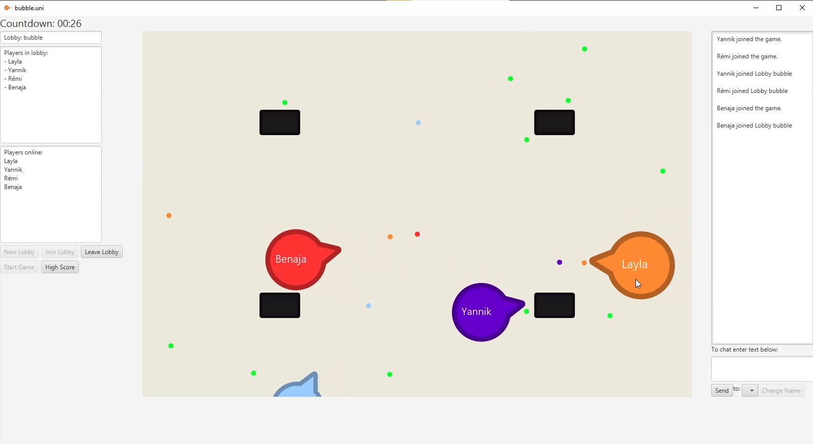

# bubble-uni

bubble.uni is a real-time game inspired by agar.io, where players control a circle-shaped character and compete to reach the largest size before the match ends. Up to four players can play at a time, but the game can also be played with just two players.

To gain mass in the game, players can collect *energizers* that are scattered throughout the play area. Players can also gain mass by shooting bubbles at their opponents, which will transfer some of their own mass to the opponent if it hits. However, players should be strategic with their *bubble* shots, as they will lose mass if they miss their target. As players gain mass, their character will become slower, making it easier for smaller, faster characters to avoid incoming shots or catch up to larger players.

The playfield is filled with black rectangles that act like black holes for bubbles, but serve as obstacles for the player characters. Players can use these rectangles to hide and protect themselves from incoming shots, but they must also navigate around them to pursue energizers or attack their opponents.

As the game progresses and the total mass of all players increases, the energizers will respawn less frequently, making it more difficult to gain mass later in the game. The goal of the game is to be the largest player at the end of the round, either by reaching the maximum mass or by being the largest player when the clock hits zero. By using strategic shooting and carefully collecting energizers, players can outmaneuver their opponents and emerge victorious.

# Technical Information

bubble.uni is written in Java and uses the JavaFX library for graphics. The game uses a server-client architecture, with a central server managing all clients over server sockets. The server has a lobby system, allowing multiple games to be played at the same time, and also includes a chat functionality with global, lobby, and whisper options for players to communicate.

On the server side, each game lobby hosts a server game loop which processes all movement and shot data from the clients to calculate positions, mass, and other relevant information. This data is then sent back to the clients to be displayed in their respective game loops.

On the client side, each player runs a client game loop which displays all data received from the server, including player characters, bubbles, and energizers. The client communicates with the server using a custom protocol, sending code words and parameters to instruct the client game loop on how to display the game.
